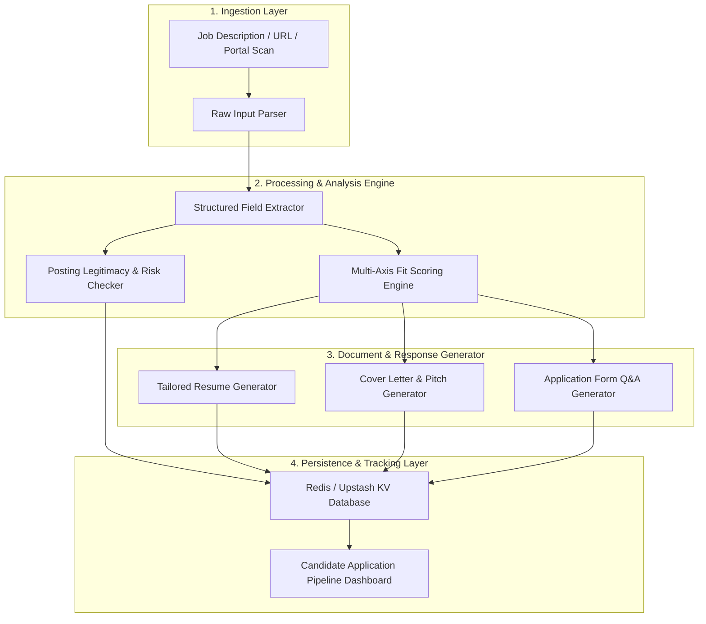
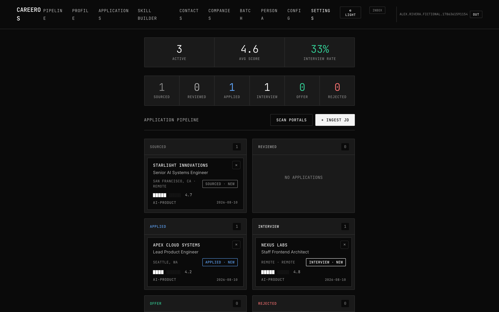
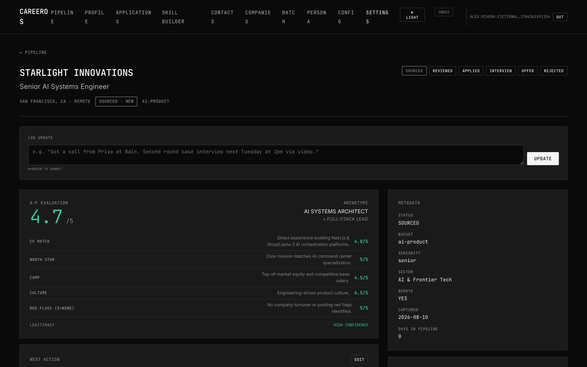
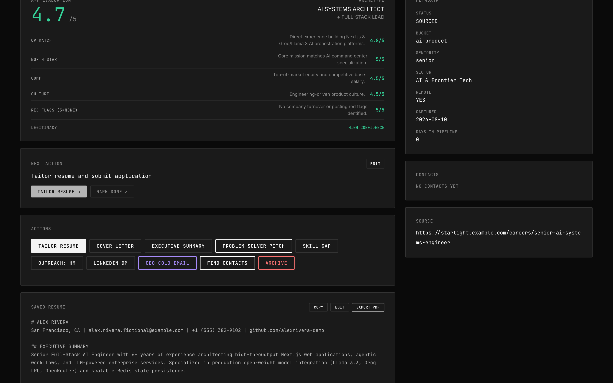

# The White Knight ⚔️

An AI-powered personal job application command center for autonomous sourcing, ATS fit scoring, and tailored document generation.

🚀 **Live Demo**: [https://the-white-knight-theta.vercel.app](https://the-white-knight-theta.vercel.app)

---

## 📌 The Problem

Managing job applications manually across dozens of company portals is fragmented, repetitive, and opaque. Job seekers spend hours re-typing profile data, tailoring resumes in isolation, and guessing whether their skills align with ATS filters or company requirements. Without a unified system to track applications, analyze fit metrics, and automate document drafting, candidate effort is wasted on administrative overhead instead of strategic career decisions.

---

## ⚙️ What It Does

- **Job Ingestion & Sourcing**: Import job descriptions via direct URL, raw text paste, or automated career portal scanning.
- **Multi-Axis AI Fit Scoring**: Quantitatively evaluate candidate profiles against job requirements across technical skills, experience depth, domain alignment, and compensation criteria.
- **Posting Legitimacy & Risk Checking**: Analyze job posting metadata and company signals to flag suspicious listings or high-turnover roles before applying.
- **Tailored Document Generation**: Instantly generate customized resumes, targeted cover letters, executive summaries, and strategic problem-solver pitches.
- **Interactive Form Q&A**: Produce candidate-grounded answers for complex job application portal questions.
- **Application Pipeline Tracking**: Centralized dashboard to track application status, outreach history, and target role buckets.

---

## 📐 Architecture Diagram



---

## 🛠️ Tech Stack

| Layer | Technologies & Libraries |
|---|---|
| **Frontend & Framework** | [Next.js](https://nextjs.org/) (v16 App Router), React 19, TypeScript, Vanilla CSS & Glassmorphism |
| **AI / LLM Integration** | Groq API (`Llama 3.3 70B`), OpenRouter API, Together AI (`DeepSeek V4 Pro`), Anthropic API, OpenAI API |
| **Data Storage & State** | Upstash Redis / Vercel KV (`@upstash/redis`), Browser LocalStorage |
| **Parsing & Utilities** | `pdf-parse` (resume text extraction), `bcryptjs` (password hashing), `jose` (JWT sessions) |
| **Deployment & Hosting** | Vercel Serverless Runtime |

---

## 🖼️ Screenshots

> ℹ️ *Note: Add your interface screenshots to the paths specified below.*

* **Pipeline Dashboard**:
  

* **Generated Fit Score**:
  

* **Tailored Resume Generator**:
  

---

## 💻 Local Setup Instructions

1. **Clone the repository**:
   ```bash
   git clone https://github.com/Haus-Nous/-The_White_knight.git
   cd -The_White_knight
   ```

2. **Install dependencies**:
   ```bash
   npm install
   ```

3. **Configure Environment Variables**:
   Copy `.env.example` to `.env.local` and set your credentials:
   ```bash
   cp .env.example .env.local
   ```
   *(Refer to [.env.example](.env.example) for the full list of required and optional environment variables).*

4. **Run the development server**:
   ```bash
   npm run dev
   ```
   Open `http://localhost:3000` in your browser.

> ⚠️ **Note**: A running Redis/KV database instance (Upstash or Vercel KV) and a valid AI provider API key (such as a free `GROQ_API_KEY` from [console.groq.com](https://console.groq.com)) are required for the application to function locally.

---

## 🔮 Vision

- **Historical Application Analytics**: Leveraging accumulated application data to identify skill gaps and recommend high-impact learning paths.
- **Portable Candidate Record**: Evolving into an open, candidate-owned professional capability ledger that integrates across hiring platforms.
- **Autonomous Opportunity Matching**: Transitioning from candidate-initiated searches to continuous background matching against verified high-fit roles.

---

## 🤖 AI Tools Used

AI tools were used both in developing this project and at runtime to power its core features — see [AI_USAGE.md](./AI_USAGE.md) for full details.